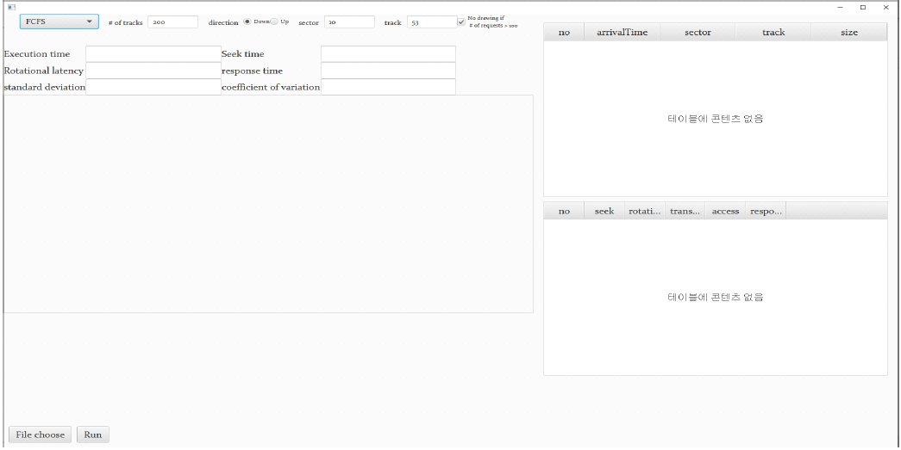

# Disk-IO-Scheduler-Visualization
Disk IO Scheduler Visualization written in Kotlin TornadoFX

## 목적
Disk IO Secheduling algorithm을 시각화해주는 프로그램입니다.
FCFS, SCAN, N-step SCAN, SATF 등을 지원합니다.
최종 업데이트 날짜 : 2021/11/22

## 결과
초기화면

프로그램에 설정된 HW spec

실행화면
* 요청마다 적혀 있는 숫자는 트랙을 의미하고 그려져 있는 원은 그 트랙을 나타낸다. 주황색은 현재 헤드의 섹터와 요청의 섹터의 거리
* 디스크는 항상 반시계 방향으로 돈다고 가정하므로 주황색과 파란 색의 경계 2곳 중 어느 곳이 헤드의 섹터 위치인지 알 수 있음
* 탐색시간, 회전지연시간 등은 디스크 암이 움직이는 시간을 고려해 간단한 비례식을 통해 

각 요청이 끝난 후 가장 access time이 짧은 요청을 실행하는 SATF가 rotational latency가 낮음을 시각화와 통계를 통해 알 수 있다.

단순 실험 결과

heavyload system에서 실험 결과 (무작위 데이터 생성)

n=1,5,10,50,100,10000일 때 N-step SCAN 응답 시간 분포도
* x는 시간, y는 처리 수
* N이 늘수록 SCAN, 1에 가까워질수록 FCFS와 비슷한 분포를 보이는 것을 알 수 있음.

이 외에도 본 프로그램을 사용해 입력 파라미터에 따른 결과 변화 등 다양한 실험을 진행할 수 있다.
